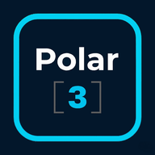

# PROMPT PROFESIONAL PARA ANTIGRAVITY
## UI/UX y Frontend para Polar[3] Sistema Operativo v2.7.12

---

## CONTEXTO GENERAL

Eres un **especialista en UI/UX y frontend** enfocado en transformar el sistema operativo Polar[3] en una aplicación visualmente moderna, ultra-responsiva y accesible. Tu tarea es mejorar HTML, CSS y gestionar el renderizado visual de componentes.

**Restricción crítica**: NO toques lógica JavaScript (app.js). Solo HTML, CSS, componentes visuales, layout e interacción del usuario.

---

## ESTADO ACTUAL

### HTML
- 4318 líneas en un único archivo
- Estructura pesada: todas las secciones inlneadas
- Duplicación de código (tablas, formularios, cards)
- Sin componentes reutilizables

### CSS
- 2960 líneas bien organizadas (variables, grid, responsive)
- Color de marca: `#00aeef` (Cyan)
- Tema actual: Light mode (bg #f4f6f9)
- Sidebar: 268px fijo (buen soporte mobile)
- Tipografía: Inter, Segoe UI

### Problemas UX
- Sidebar en mobile: occupa 100% ancho, difícil de interactuar
- Formularios: sin validación visual en tiempo real
- Tablas grandes: scroll horizontal invisible en mobile
- Modales: sin animaciones suaves
- Dark mode: no existe
- Contraste: algunos textos débiles en fondo claro

---

## MEJORAS PRIORITARIAS

### ALTO IMPACTO

1. **Componentes reutilizables**
   - Card (header, body, footer)
   - Form group (input + label + error)
   - Button (primario, outline, ghost, con loading)
   - Badge / Tag
   - Alert / Notification
   - Modal / Dialog
   - Table responsive (scroll inteligente)
   - Tabs / Accordion
   - Spinner / Skeleton loader

2. **Responsividad mejorada**
   - Breakpoints: 320px, 480px, 768px, 1024px, 1440px
   - Sidebar: drawer móvil (slide from left)
   - Grid: 2-col en mobile, 3-col en tablet, 4-col desktop
   - Typography: escalado fluido (clamp)
   - Touchable: min 44x44px buttons

3. **Animaciones y transiciones**
   - Sidebar in/out: 250ms ease-out
   - Modal fade-in: 200ms cubic-bezier
   - Tooltip hover: 150ms delay
   - Loading spinner: 360° 1s infinite
   - Page transition: fade 100ms

4. **Dark mode completo**
   - Toggle en topbar
   - CSS vars ya soportan (agregar --dark-*)
   - Sistema de persistencia en localStorage
   - Auto-detectar `prefers-color-scheme`

5. **Validación visual en formularios**
   - Estado válido: borde verde, icon ✓
   - Estado inválido: borde rojo, icon ✗, mensaje de error
   - Estados: empty, focused, filled, valid, error
   - Transiciones suaves de colores

6. **Accesibilidad (a11y)**
   - ARIA labels en botones
   - Focus states visibles (outline 2px)
   - Color + forma + texto (no solo color)
   - Ratios de contraste WCAG AA
   - Semantic HTML (<main>, <nav>, <section>)
   - Keyboard navigation (Tab, Enter, Escape)

7. **Mobile-first optimizations**
   - Bottom tabbar: 60px height + safe-area
   - Sidebar overlay: semi-transparent backdrop
   - Formularios: single column en mobile
   - Scroll: suave en iOS
   - Input: font-size 16px (prevenir zoom)

---

## TAREAS ESPECÍFICAS (EN ORDEN)

### ENTREGA 1: Auditoría Visual y Componentes Base

#### 1.1 Crear `design-system.md`
Documento con:
- Paleta de colores (light + dark)
- Tipografía (escala fluida)
- Espaciado (spacing scale: 4px, 8px, 12px, 16px, 24px, 32px)
- Bordes y radios (radius: 4px, 8px, 12px, 16px)
- Sombras (shadow: sm, md, lg)
- Breakpoints
- Componentes base (nombre + specs)

#### 1.2 Crear `components.html`
Archivo de referencia con todos los componentes:
```html
<!DOCTYPE html>
<html>
<head>
<title>Polar[3] — Component Library</title>
<link rel="stylesheet" href="styles.css">
</head>
<body>

<section class="component-section">
  <h2>Buttons</h2>
  <div class="component-group">
    <button class="btn btn-primary">Primary</button>
    <button class="btn btn-outline">Outline</button>
    <button class="btn btn-ghost">Ghost</button>
    <button class="btn btn-primary" disabled>Disabled</button>
    <button class="btn btn-primary btn-loading">
      <span class="spinner"></span> Cargando...
    </button>
  </div>
</section>

<section class="component-section">
  <h2>Form Groups</h2>
  <div class="form-group">
    <label for="input-valid">Email válido</label>
    <input id="input-valid" type="email" class="input input-valid" value="user@example.com">
    <span class="input-message input-valid">✓ Email válido</span>
  </div>
  <div class="form-group">
    <label for="input-error">Email inválido</label>
    <input id="input-error" type="email" class="input input-error" value="invalid">
    <span class="input-message input-error">✗ Formato inválido</span>
  </div>
</section>

<section class="component-section">
  <h2>Cards</h2>
  <div class="card">
    <div class="card-header">
      <h3>Card Title</h3>
    </div>
    <div class="card-body">
      <p>Card content goes here.</p>
    </div>
    <div class="card-footer">
      <button class="btn btn-outline btn-sm">Action</button>
    </div>
  </div>
</section>

<section class="component-section">
  <h2>Alerts</h2>
  <div class="alert alert-info">
    <span class="alert-icon">ℹ️</span>
    <span>This is an info alert</span>
  </div>
  <div class="alert alert-success">
    <span class="alert-icon">✓</span>
    <span>This is a success alert</span>
  </div>
  <div class="alert alert-warning">
    <span class="alert-icon">⚠️</span>
    <span>This is a warning alert</span>
  </div>
  <div class="alert alert-error">
    <span class="alert-icon">✗</span>
    <span>This is an error alert</span>
  </div>
</section>

...más componentes...

</body>
</html>
```

#### 1.3 Agregar a `styles.css`
```css
/* ═══════════════════════════════════════════════════════════════
   COMPONENTES BASE
═══════════════════════════════════════════════════════════════ */

/* Buttons */
.btn {
  display: inline-flex;
  align-items: center;
  gap: 8px;
  padding: 10px 16px;
  border-radius: var(--radius);
  font-weight: 600;
  font-size: 14px;
  transition: all var(--transition);
  cursor: pointer;
  border: 1px solid transparent;
  white-space: nowrap;
  min-height: 44px; /* Touch target */
  justify-content: center;
}

.btn:disabled {
  opacity: 0.5;
  cursor: not-allowed;
}

.btn-primary {
  background: var(--accent);
  color: white;
}

.btn-primary:hover:not(:disabled) {
  background: var(--accent-dark);
  transform: translateY(-1px);
  box-shadow: 0 4px 12px rgba(0, 174, 239, 0.3);
}

.btn-outline {
  border: 1px solid var(--border);
  color: var(--text-primary);
  background: transparent;
}

.btn-outline:hover:not(:disabled) {
  background: var(--accent-soft);
  border-color: var(--accent);
}

.btn-ghost {
  color: var(--accent);
  background: transparent;
}

.btn-ghost:hover:not(:disabled) {
  background: var(--accent-soft2);
}

.btn-sm {
  padding: 6px 12px;
  font-size: 13px;
  min-height: 36px;
}

.btn-loading {
  opacity: 0.8;
  pointer-events: none;
}

/* Form Groups */
.form-group {
  display: flex;
  flex-direction: column;
  gap: 6px;
  margin-bottom: 16px;
}

.form-group label {
  font-weight: 600;
  font-size: 14px;
  color: var(--text-primary);
}

.input {
  padding: 10px 14px;
  border: 1px solid var(--border);
  border-radius: var(--radius-sm);
  font-size: 16px; /* Prevenir zoom iOS */
  font-family: inherit;
  transition: all var(--transition);
  background: var(--bg-card);
}

.input:focus {
  outline: none;
  border-color: var(--accent);
  box-shadow: 0 0 0 3px rgba(0, 174, 239, 0.1);
}

.input-valid {
  border-color: var(--success);
}

.input-valid:focus {
  box-shadow: 0 0 0 3px rgba(56, 161, 105, 0.1);
}

.input-error {
  border-color: var(--danger);
}

.input-error:focus {
  box-shadow: 0 0 0 3px rgba(229, 62, 62, 0.1);
}

.input-message {
  font-size: 12px;
  font-weight: 500;
  display: none;
}

.input-valid ~ .input-message.input-valid {
  display: block;
  color: var(--success);
}

.input-error ~ .input-message.input-error {
  display: block;
  color: var(--danger);
}

/* Alerts */
.alert {
  display: flex;
  align-items: flex-start;
  gap: 12px;
  padding: 12px 16px;
  border-radius: var(--radius-sm);
  border: 1px solid;
  font-size: 14px;
}

.alert-info {
  background: #e8f5fc;
  border-color: #b3d9e8;
  color: #1e5a72;
}

.alert-success {
  background: #e8f8f1;
  border-color: #9dd4be;
  color: #1a5c47;
}

.alert-warning {
  background: #fff4e6;
  border-color: #f6a85c;
  color: #7a4a1f;
}

.alert-error {
  background: #fce8e8;
  border-color: #e5a5a5;
  color: #8d2f2f;
}

.alert-icon {
  flex-shrink: 0;
  font-size: 18px;
}

/* Spinner */
.spinner {
  display: inline-block;
  width: 16px;
  height: 16px;
  border: 2px solid rgba(255, 255, 255, 0.3);
  border-radius: 50%;
  border-top-color: white;
  animation: spin 1s linear infinite;
}

@keyframes spin {
  to { transform: rotate(360deg); }
}

/* Skeleton loader */
.skeleton {
  background: linear-gradient(90deg, #f0f0f0 25%, #e0e0e0 50%, #f0f0f0 75%);
  background-size: 200% 100%;
  animation: loading 1.5s infinite;
}

@keyframes loading {
  0% { background-position: 200% 0; }
  100% { background-position: -200% 0; }
}
```

**ENTREGAR COMO**: design-system.md + components.html + estilos en styles.css

---

### ENTREGA 2: Refactor HTML (Modularización de estructura)

#### 2.1 Crear estructura modular
```
index.html (scaffold mínimo, ~300 líneas)
├── <head> con metas + styles crítico inline
├── <body>
│  ├── <div id="sidebar"></div>
│  ├── <main id="main"></main>
│  ├── <div id="modals"></div>
│  └── <script defer src="app.js"></script>
```

#### 2.2 Crear `/templates/` (contenido por sección)
```
templates/
├── sections/
│  ├── inicio.html (home + cards principales)
│  ├── appcenter.html (centro de aplicaciones)
│  ├── calendario.html (calendario anual)
│  ├── checklist.html (jornada de toma)
│  ├── cobranzas.html (cobro de familias)
│  ├── kpis.html (panel de KPIs)
│  └── ...más secciones...
│
├── components/
│  ├── sidebar.html
│  ├── topbar.html
│  ├── mobile-tabbar.html
│  ├── card-header.html
│  ├── form-cobro.html
│  ├── table-cobranzas.html
│  └── modal-precio.html
│
└── partials/
   ├── _navigation.html
   ├── _buttons.html
   ├── _inputs.html
   └── _alerts.html
```

#### 2.3 Agregar a `app.js` (NO CAMBIAR LÓGICA)
```javascript
// Solo: carga de templates
async function loadTemplate(sectionId) {
  const response = await fetch(`./templates/sections/${sectionId}.html`);
  return await response.text();
}

function renderSection(sectionId, html) {
  const main = document.getElementById('main');
  main.innerHTML = html;
  attachEventListeners(); // Esperar a que UI esté lista
}
```

**ENTREGAR COMO**: index.html refactorizado + /templates/ completa

---

### ENTREGA 3: Dark Mode + Tema Nocturno

#### 3.1 Agregar a `:root` en CSS
```css
:root {
  /* Light mode (actual) */
  --accent: #00aeef;
  --bg-main: #f4f6f9;
  --text-primary: #1e2433;
  ...
}

@media (prefers-color-scheme: dark) {
  :root {
    --accent: #00d9ff;
    --bg-main: #0f1117;
    --bg-card: #161b22;
    --text-primary: #e6edf3;
    --text-secondary: #8b949e;
    --sidebar-bg: #0d1117;
    ...
  }
}

html[data-theme="dark"] {
  --accent: #00d9ff;
  --bg-main: #0f1117;
  ...
}

html[data-theme="light"] {
  /* Explicit light (default) */
}
```

#### 3.2 Toggle en topbar
```html
<!-- En topbar -->
<button class="theme-toggle" id="themeToggle" aria-label="Toggle dark mode">
  <span class="theme-icon">🌙</span>
</button>
```

#### 3.3 JavaScript para theme (puede estar en app.js)
```javascript
function initTheme() {
  const savedTheme = localStorage.getItem('polar3_theme');
  const prefersDark = window.matchMedia('(prefers-color-scheme: dark)').matches;
  const theme = savedTheme || (prefersDark ? 'dark' : 'light');
  
  document.documentElement.setAttribute('data-theme', theme);
}

function toggleTheme() {
  const current = document.documentElement.getAttribute('data-theme');
  const next = current === 'dark' ? 'light' : 'dark';
  
  document.documentElement.setAttribute('data-theme', next);
  localStorage.setItem('polar3_theme', next);
  
  updateThemeIcon(next);
}

document.getElementById('themeToggle').addEventListener('click', toggleTheme);
initTheme();
```

**ENTREGAR COMO**: CSS actualizado + HTML actualizado + script tema

---

### ENTREGA 4: Formularios Validación Visual + UX

#### 4.1 HTML de formulario mejorado
```html
<form class="form" id="cobrosForm">
  <div class="form-group">
    <label for="escuela">Institución *</label>
    <input 
      id="escuela" 
      type="text" 
      class="input"
      placeholder="Ej: San Martín"
      required
      data-validate="school"
      aria-label="Nombre de la institución"
    />
    <span class="input-message input-error" role="alert"></span>
  </div>

  <div class="form-grid">
    <div class="form-group">
      <label for="precio">Precio $</label>
      <input 
        id="precio" 
        type="number" 
        class="input"
        inputmode="numeric"
        data-validate="currency"
      />
      <span class="input-message input-error" role="alert"></span>
    </div>
    <div class="form-group">
      <label for="cantidad">Cantidad</label>
      <input 
        id="cantidad" 
        type="number" 
        class="input"
        min="1"
        data-validate="quantity"
      />
      <span class="input-message input-error" role="alert"></span>
    </div>
  </div>

  <div class="form-actions">
    <button type="submit" class="btn btn-primary">Guardar</button>
    <button type="reset" class="btn btn-outline">Limpiar</button>
  </div>
</form>
```

#### 4.2 CSS para validación visual
```css
.input {
  /* Base */
  padding: 10px 14px;
  border: 1px solid var(--border);
  border-radius: var(--radius-sm);
  font-size: 16px;
  transition: all var(--transition);
}

.input:focus {
  outline: none;
  border-color: var(--accent);
  box-shadow: 0 0 0 3px var(--accent-soft);
}

.input.input-error {
  border-color: var(--danger);
}

.input.input-error:focus {
  box-shadow: 0 0 0 3px rgba(229, 62, 62, 0.1);
}

.input.input-valid {
  border-color: var(--success);
}

.input.input-valid:focus {
  box-shadow: 0 0 0 3px rgba(56, 161, 105, 0.1);
}

/* Mensajes de error */
.input-message {
  font-size: 12px;
  font-weight: 500;
  max-height: 0;
  overflow: hidden;
  transition: max-height 0.2s ease;
  color: transparent;
}

.input.input-error + .input-message {
  max-height: 20px;
  color: var(--danger);
  display: block;
}

.input.input-valid + .input-message {
  max-height: 20px;
  color: var(--success);
  display: block;
}

/* Grid responsivo en formularios */
.form-grid {
  display: grid;
  grid-template-columns: repeat(auto-fit, minmax(200px, 1fr));
  gap: 16px;
}

@media (max-width: 480px) {
  .form-grid {
    grid-template-columns: 1fr;
  }
}

/* Acciones */
.form-actions {
  display: flex;
  gap: 12px;
  margin-top: 24px;
}

@media (max-width: 480px) {
  .form-actions {
    flex-direction: column;
  }

  .form-actions .btn {
    width: 100%;
  }
}
```

**ENTREGAR COMO**: HTML + CSS para formularios mejorados

---

### ENTREGA 5: Mobile UX + Responsive Design

#### 5.1 Mejorar viewport y safe-area
```html
<meta name="viewport" content="width=device-width, initial-scale=1.0, viewport-fit=cover">
```

#### 5.2 CSS Mobile-first
```css
/* Breakpoints */
$breakpoint-mobile: 320px;
$breakpoint-tablet: 480px;
$breakpoint-desktop: 768px;
$breakpoint-wide: 1024px;

/* Sidebar: drawer en mobile */
#sidebar {
  position: fixed;
  left: 0;
  top: 0;
  width: var(--sidebar-w);
  height: 100vh;
  transform: translateX(-100%);
  transition: transform 250ms cubic-bezier(0.4, 0, 0.2, 1);
  z-index: 200;
}

#sidebar.open {
  transform: translateX(0);
}

.sidebar-overlay {
  position: fixed;
  inset: 0;
  background: rgba(0, 0, 0, 0.5);
  z-index: 150;
  opacity: 0;
  pointer-events: none;
  transition: opacity 250ms ease;
}

.sidebar-overlay.visible {
  opacity: 1;
  pointer-events: auto;
}

/* Main content */
main {
  margin-left: var(--sidebar-w);
  margin-bottom: 80px; /* Safe area para tabbar móvil */
}

@media (max-width: 768px) {
  main {
    margin-left: 0;
  }
}

/* Mobile tabbar */
.mobile-tabbar {
  position: fixed;
  bottom: 0;
  left: 0;
  right: 0;
  height: 60px;
  background: var(--bg-card);
  border-top: 1px solid var(--border);
  display: flex;
  justify-content: space-around;
  padding-bottom: env(safe-area-inset-bottom);
  z-index: 100;
}

@media (min-width: 769px) {
  .mobile-tabbar {
    display: none;
  }
}

.mobile-tabbar-btn {
  display: flex;
  flex-direction: column;
  align-items: center;
  justify-content: center;
  gap: 4px;
  flex: 1;
  border: none;
  background: none;
  color: var(--text-muted);
  font-size: 12px;
  cursor: pointer;
  transition: all var(--transition);
}

.mobile-tabbar-btn:active,
.mobile-tabbar-btn.active {
  color: var(--accent);
}

.mobile-tabbar-btn span {
  font-size: 24px;
}

/* Tipografía fluida */
h1 { font-size: clamp(24px, 5vw, 32px); }
h2 { font-size: clamp(20px, 4vw, 28px); }
h3 { font-size: clamp(18px, 3.5vw, 24px); }
body { font-size: clamp(14px, 2vw, 16px); }

/* Tablas en mobile */
.table-wrap {
  overflow-x: auto;
  -webkit-overflow-scrolling: touch;
}

@media (max-width: 768px) {
  table {
    font-size: 12px;
  }

  table th, table td {
    padding: 8px 12px;
  }
}

/* Cards en grid responsivo */
.card-grid {
  display: grid;
  grid-template-columns: repeat(auto-fit, minmax(280px, 1fr));
  gap: 20px;
}

@media (max-width: 480px) {
  .card-grid {
    grid-template-columns: 1fr;
    gap: 12px;
  }
}
```

#### 5.3 Tocar targets mínimos
```css
/* Botones y elementos interactivos */
button, a, input[type="radio"], input[type="checkbox"] {
  min-height: 44px;
  min-width: 44px;
}

/* Espaciado extra en mobile */
@media (max-width: 480px) {
  .btn {
    padding: 12px 18px;
  }

  .input {
    padding: 12px 16px;
  }
}
```

**ENTREGAR COMO**: CSS mobile-first + ajustes en HTML para safe-area

---

### ENTREGA 6: Animaciones + Interacciones Suaves

#### 6.1 Agregar animaciones a CSS
```css
/* Transiciones globales */
* {
  transition-property: background-color, border-color, color, opacity;
  transition-duration: var(--transition);
}

/* Fade in de secciones */
@keyframes fadeIn {
  from {
    opacity: 0;
    transform: translateY(10px);
  }
  to {
    opacity: 1;
    transform: translateY(0);
  }
}

.section {
  animation: fadeIn 300ms ease-out;
}

/* Modal in */
@keyframes modalSlideIn {
  from {
    opacity: 0;
    transform: translateY(20px);
  }
  to {
    opacity: 1;
    transform: translateY(0);
  }
}

dialog, .modal {
  animation: modalSlideIn 200ms cubic-bezier(0.4, 0, 0.2, 1);
}

/* Hover effects en cards */
.card {
  transition: all var(--transition);
}

.card:hover {
  transform: translateY(-2px);
  box-shadow: 0 8px 24px rgba(0, 0, 0, 0.12);
}

/* Loading spinner */
@keyframes spin {
  from { transform: rotate(0deg); }
  to { transform: rotate(360deg); }
}

.spinner {
  animation: spin 1s linear infinite;
}

/* Toast animations */
@keyframes slideIn {
  from {
    transform: translateX(100%);
    opacity: 0;
  }
  to {
    transform: translateX(0);
    opacity: 1;
  }
}

.toast {
  animation: slideIn 300ms cubic-bezier(0.4, 0, 0.2, 1);
}
```

#### 6.2 Smooth scroll
```css
html {
  scroll-behavior: smooth;
}

@media (prefers-reduced-motion: reduce) {
  * {
    animation-duration: 0.01ms !important;
    animation-iteration-count: 1 !important;
    transition-duration: 0.01ms !important;
    scroll-behavior: auto !important;
  }
}
```

**ENTREGAR COMO**: Keyframes + animaciones en styles.css

---

### ENTREGA 7: Accesibilidad (a11y) + SEO

#### 7.1 Mejorar HTML semántico
```html
<!-- ❌ Antes -->
<div onclick="showSection('cobranzas')">Cobranzas</div>

<!-- ✅ Después -->
<a 
  href="#cobranzas" 
  role="button"
  aria-label="Ir a panel de cobranzas"
  data-section="cobranzas"
>
  💳 Cobranzas
</a>
```

#### 7.2 Focus management
```css
/* Focus visible para keyboard nav */
:focus-visible {
  outline: 2px solid var(--accent);
  outline-offset: 2px;
}

button:focus-visible,
a:focus-visible,
input:focus-visible,
select:focus-visible,
textarea:focus-visible {
  outline: 2px solid var(--accent);
  outline-offset: 2px;
}

/* Ocultar focus al usar mouse */
:focus:not(:focus-visible) {
  outline: none;
}
```

#### 7.3 ARIA labels
```html
<button 
  id="sidebarToggle" 
  aria-label="Abrir menú de navegación"
  aria-expanded="false"
  aria-controls="sidebar"
>
  ☰
</button>

<nav id="sidebar" aria-label="Navegación principal" role="navigation">
  <!-- Nav items -->
</nav>

<!-- Modales -->
<div role="dialog" aria-labelledby="modalTitle" aria-modal="true">
  <h2 id="modalTitle">Confirmar acción</h2>
  <!-- Modal content -->
</div>

<!-- Formularios -->
<form aria-label="Formulario de cobranza">
  <div class="form-group">
    <label for="escuela">Institución</label>
    <input id="escuela" required aria-required="true" />
    <span class="error-message" role="alert" aria-live="polite"></span>
  </div>
</form>
```

#### 7.4 Color contrast validation
```
✓ Verde → Rojo: validar ratios WCAG AA (4.5:1 mín)
✓ Textos en fondo gris → mínimo 4.5:1
✓ Iconos + texto (no solo color para estados)
```

**ENTREGAR COMO**: HTML actualizado + CSS a11y + documentación

---

### ENTREGA 8: Performance + Optimizaciones Visual

#### 8.1 CSS crítico inline
```html
<head>
  <style>
    :root {
      --accent: #00aeef;
      --bg-main: #f4f6f9;
      ...
    }
    html, body { box-sizing: border-box; margin: 0; padding: 0; }
    body { font-family: Inter, sans-serif; background: var(--bg-main); }
    main { margin-left: var(--sidebar-w); margin-bottom: 80px; }
    #sidebar { position: fixed; ... }
    .mobile-tabbar { position: fixed; ... }
    /* Resto de estilos en archivo externo */
  </style>
  <link rel="stylesheet" href="styles.css" media="print" onload="this.media='all'">
</head>
```

#### 8.2 Image optimization
```html
<!-- Usar srcset y WebP -->

```

#### 8.3 Lazy loading de secciones
```html
<script>
  // Cargar templates solo cuando se necesiten
  const sectionLinks = document.querySelectorAll('[data-section]');
  
  sectionLinks.forEach(link => {
    link.addEventListener('click', (e) => {
      e.preventDefault();
      const sectionId = link.dataset.section;
      loadSection(sectionId);
    });
  });
</script>
```

#### 8.4 Web Vitals checklist
```
☑ LCP (Largest Contentful Paint): < 2.5s
☑ FID (First Input Delay): < 100ms (desde JS, no controlable)
☑ CLS (Cumulative Layout Shift): < 0.1
  └─ Usar `width` y `height` en imágenes
  └─ Reservar espacio para ads/iframes
  └─ No insertar contenido arriba del viewport
```

**ENTREGAR COMO**: index.html optimizado + imagen guidelines

---

## CHECKLIST FINAL

Antes de entregar cada fase:
- ☑ Sin colores hardcodeados (usar CSS vars)
- ☑ Mobile first: probado en 320px-768px-1440px
- ☑ Dark mode: toggle y estilos listos
- ☑ Accesibilidad: WCAG AA (contrastes, ARIA, keyboard)
- ☑ Animaciones: suaves (prefers-reduced-motion respetado)
- ☑ Sin jank: scroll 60fps, transiciones suaves
- ☑ Performance: Lighthouse >= 85 en Performance
- ☑ Componentes: reutilizables, sin duplicación
- ☑ Documentado: design-system.md actualizado

---

## ORDEN RECOMENDADO

1. **Entrega 1**: Auditoría + componentes base (day 1)
2. **Entrega 2**: Modularizar HTML + templates (day 1-2)
3. **Entrega 3**: Dark mode (day 2)
4. **Entrega 4**: Formularios validación visual (day 2-3)
5. **Entrega 5**: Mobile UX + responsividad (day 3-4)
6. **Entrega 6**: Animaciones (day 4)
7. **Entrega 7**: Accesibilidad (day 4-5)
8. **Entrega 8**: Performance (day 5)

---

**¿Listo? Comienza con Entrega 1 (Auditoría Visual + Componentes Base).**
